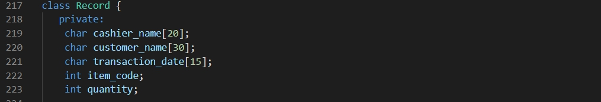
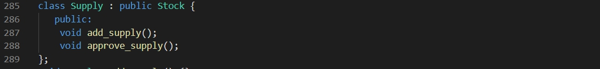
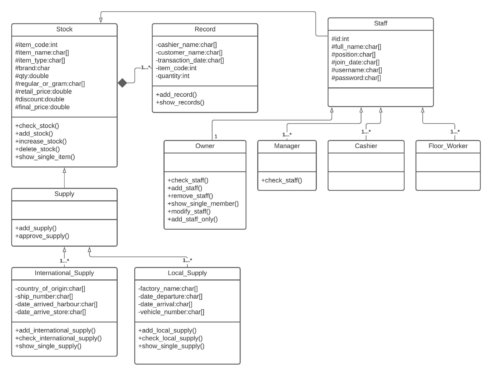

# Supermarket Inventory System 
# OOP Concepts 
In object-oriented programming there are four main basic concepts. Those are,  
* Encapsulation 
* Abstraction 
* Inheritance 
* Polymorphism 
 
These four basic concepts are seeming very complex. But understanding the general framework of how those concepts are working will help to understand the basic of object- oriented programming. In using these basic concepts, first we should have basic knowledge about classes and objects.
 

## Encapsulation  
Encapsulation is used in this to hide some data of the class from outside world. private keyword is used for encapsulation.
 

 
Figure 1 : Use of encapsulation for Record class
 
The different objects inside of a program will try to communicate with each other automatically. Encapsulation is the mechanism that binds together code and the data it manipulates and keeps both safe from the outside interface and misuse. By this process, programmer can stop objects from interreacting with each other, that object need to be encapsulated in individual classes. After the encapsulation classes cannot interact with the specific variables and function of an object. This encapsulation just like as the medication inside of the capsule. Capsule works as a protective cover for the medication. Just as it, encapsulation work as the protective cover as for data.
 

## Abstraction  
Abstraction is like as an upgraded version of a encapsulation. Because by abstraction it hides certain properties and methods from outside code to make the interface of the object simpler. As an example, we can think abstraction as a car. Then abstraction allow people to drive to the grocery store without being overwhelmed by the complexity of the parts that from the car. Abstraction gives several benefits for a programmer such as abstraction helps to isolate the impact of changes made to the code so that if something goes wrong then change will only affect to the variable shown and not to the outside code.
 

## Inheritance
 
Inheritance is used to declare the classes which can use some attributes from another class. The following is a list of base and derived classes.  

| Base Class | Inherited Class                    |
|------------|------------------------------------|
| Stock      | Supply                             |
| Supply     | International_Supply Local_Supply  |
| Staff      | Owner Manager Cashier Floor_Worker |

 

Figure 1 : Use of inheritance for Supply class

 
According to the inheritance concept, programmer can extend the functionality of the code’ existing classes to eliminate repetitive code. For instance, elements of HTML code that include the text box, select field and checkbox have certain properties in common with specific method. Simply inheritance is the process by which one object acquires the properties on another object. By using this method, we can reduce the unnecessary code. So, the main class is the superclass and all classes that follows that supper class are subclasses. Subclasses also can have separate subclasses too.
 

## Polymorphism 
 
The meaning of the polymorphism word is the “many forms or shapes”. By polymorphism, it allows programmers to render multiple HTML elements depending on the type of the class. It means this interface to be used for a general class of action. This concept allows programmers to redefine the way something works by changing the parts in which it is done. Terms of polymorphism are called overriding and overloading.
 

# UML DIAGRAM OF THE DESIGN

